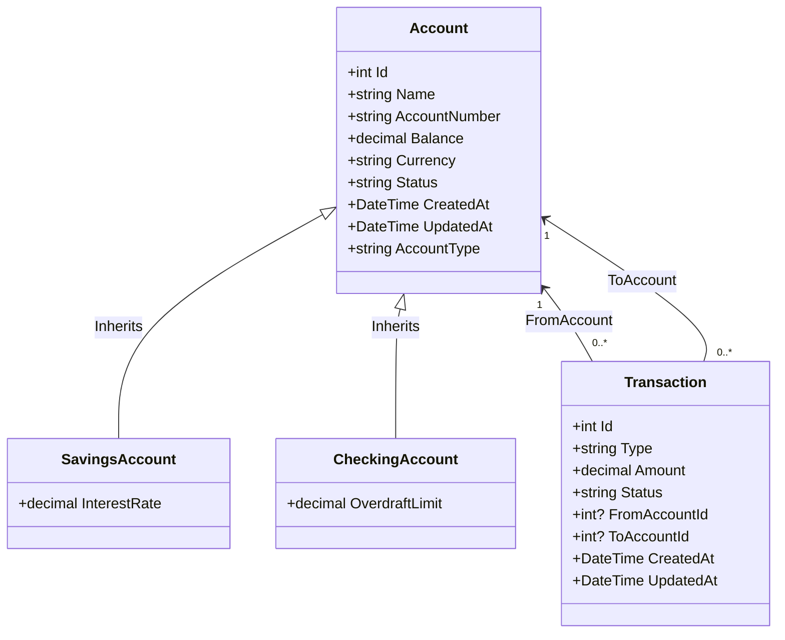

# BankingApp

### This documentation is dedicated for the api as there is no other project in the BankingApp solution


# Banking API

## Overview
A .NET Core 8 Web API project implementing basic banking operations and transactions management. This API provides functionality for managing bank accounts and handling financial transactions including deposits, withdrawals, and transfers.

---

## Features
- **Account Management:** Create, read, update, and delete (CRUD) different types of accounts (Savings, Checking).
- **Transaction Management:** Create, read, update, and delete (CRUD) transactions.
- **Transaction Operations** Process deposits and withdrawals and transfers
- **Polymorphic Accounts:** Supports Savings and Checking accounts with custom configurations.
- **Seed Data:** Preloaded accounts and transactions for testing.
- **SQL Database Support:** Uses **Entity Framework Core** for database migrations.

---

## Technologies Used

- **.NET 8 (LTS)**
  - Chosen for its Long Term Support status
  - Built-in Swagger support for API documentation

- **SQL Server**
  - Robust database management system
  - Strong data integrity and transaction support

- **Entity Framework Core**
  - Code-first approach for database management
  - Automated database migrations
  - Powerful LINQ query capabilities

---

## Prerequisites

Before running this project, ensure you have the following installed:
- .NET 8 SDK
- SQL Server
- An IDE (Visual Studio 2022 recommended)

---

## Getting Started

1. **Clone the Repository**
   ```bash
   git clone https://github.com/Mostafa1Jamal1/BankingApp.git
   cd BankingApp/api
   ```

2. **Database Configuration**
   - Open `appsettings.json`
   - Update the connection string to match your SQL Server instance:
   ```json
   "ConnectionStrings": {
     "DefaultConnection": "Server=[YourServer];Database=BankingApp;Trusted_Connection=True;MultipleActiveResultSets=true"
   }
   ```

3. **Apply Database Migrations**
   ```bash
   dotnet ef database update
   ```

4. **Run the Application**
   ```bash
   dotnet run
   ```

5. **Access Swagger Documentation**

    - get the port number from launchSettings.json file in the Properties folder
   - Navigate to `https://localhost:[port]/swagger` in your web browser
   - Full API documentation and testing interface available through Swagger UI

---

## Database Schema

The application uses the following database structure:

1. **Accounts Table**
   - Base table for all account types
   - Implements Table-Per-Hierarchy (TPH) pattern for different account types
   - Common fields: Id, Name, AccountNumber, Balance, Currency, Status
   - Type-specific fields:
     - SavingsAccount: InterestRate
     - CheckingAccount: OverdraftLimit

2. **Transactions Table**
   - Tracks all financial transactions
   - Fields: Id, Type, Amount, Status, FromAccountId, ToAccountId, CreatedAt, UpdatedAt


## API Documentation

Full API documentation and testing interface available through Swagger UI when running the application.

### Endpoints
---

### **1. AccountsCRUDController**  
**Base Route:** `/api/v1/accounts`  

| **HTTP Method** | **Endpoint**                | **Functionality**                                           |
|-----------------|-----------------------------|-------------------------------------------------------------|
| **GET**         | `/api/v1/accounts`          | Fetch all accounts with basic details.                     |
| **GET**         | `/api/v1/accounts/{id}`     | Fetch details of a specific account by ID.                 |
| **POST**        | `/api/v1/accounts`          | Create a new account based on the provided account type.   |
| **PUT**         | `/api/v1/accounts/{id}`     | Update details of a specific account by ID.                |
| **DELETE**      | `/api/v1/accounts/{id}`     | Delete an account by ID.                                    |

---

### **2. OperationController**  
**Base Route:** `/api/accounts`  

| **HTTP Method** | **Endpoint**                   | **Functionality**                                                 |
|-----------------|--------------------------------|-------------------------------------------------------------------|
| **GET**         | `/api/accounts/{id}/balance`   | Retrieve the balance of a specific account by ID.                |
| **POST**        | `/api/accounts/deposit`        | Deposit a specified amount into an account.                      |
| **POST**        | `/api/accounts/withdraw`       | Withdraw a specified amount from an account if funds are enough. |
| **POST**        | `/api/accounts/transfer`       | Transfer funds between two accounts if sufficient funds exist.   |

---

### **3. TransactionsCRUDController**  
**Base Route:** `/api/v1/transactions`  

| **HTTP Method** | **Endpoint**                          | **Functionality**                                     |
|-----------------|---------------------------------------|-------------------------------------------------------|
| **GET**         | `/api/v1/transactions`                | Fetch all transactions.                               |
| **GET**         | `/api/v1/transactions/{id}`           | Fetch details of a specific transaction by ID.        |
| **POST**        | `/api/v1/transactions`                | Create a new transaction record.                      |
| **PUT**         | `/api/v1/transactions/{id}`           | Update details of a specific transaction by ID.       |
| **DELETE**      | `/api/v1/transactions/{id}`           | Delete a transaction by ID.                           |

---


## Example Requests
### **Create Account**
```bash
POST /api/accounts
Content-Type: application/json
{
  "name": "John Doe",
  "accountNumber": "1234567890",
  "balance": 1000.00,
  "currency": "USD",
  "status": "Active"
}
```

### **Create Transaction**
```bash
POST /api/transactions
Content-Type: application/json
{
  "type": "Transfer",
  "status": "Completed",
  "amount": 200.00,
  "fromAccountId": 1,
  "toAccountId": 2
}
```

---

## License
This project is licensed under the MIT License. See the LICENSE file for details.

